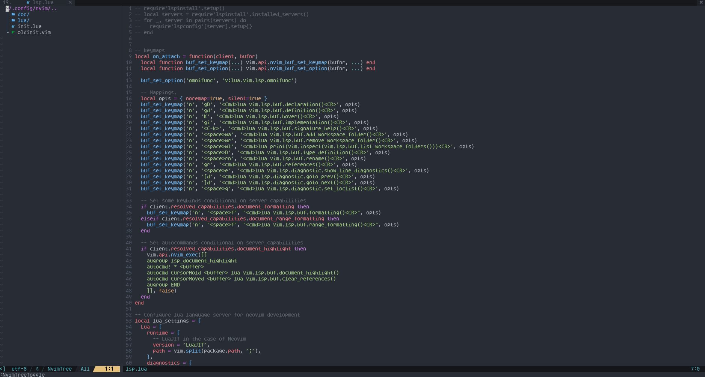

# nii-nvim

Nii-Nvim is a very minimal nvim dotfiles focused on creating a functional editor with a minmal amount of plugins. nii-nvim also has the user in mind by being very extensible and documented.

#### Screenshots

