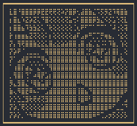
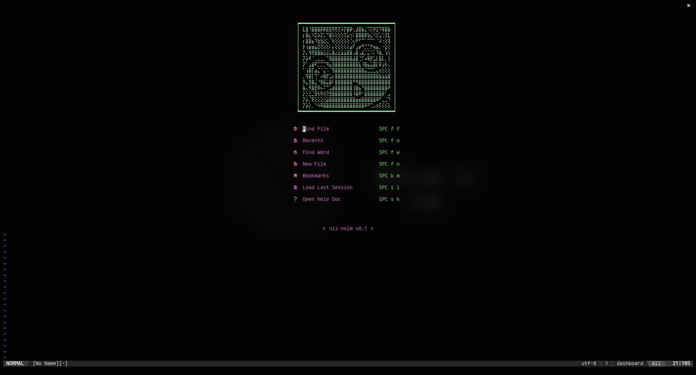
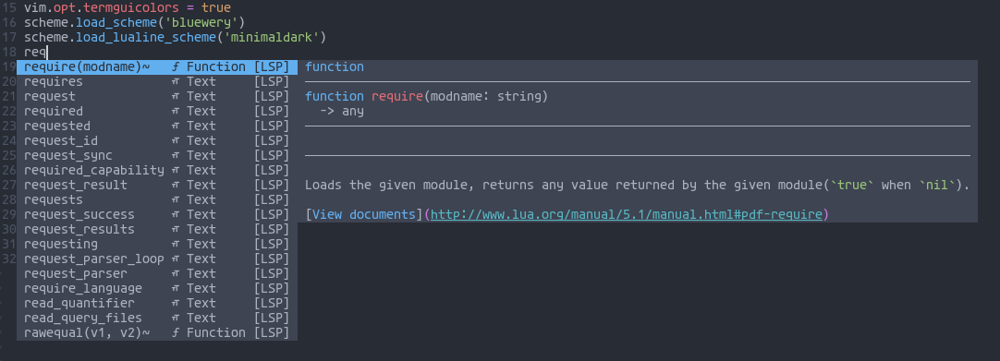
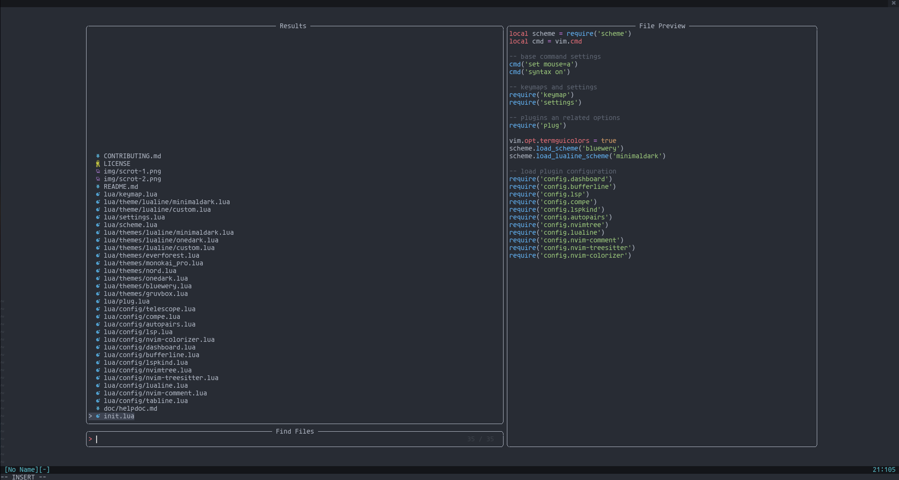

<h1 align="center">nii-nvim - a no-nonsense neovim configuration</h1>

  <a href="https://github.com/Theory-of-Everything/nii-nvim/wiki">Wiki</a>
   • 
  <a href="https://github.com/Theory-of-Everything/nii-nvim/wiki/Installation">Install</a>
   • 
  <a href="https://github.com/Theory-of-Everything/nii-nvim/blob/master/CONTRIBUTING.md">Contribute</a>
  

  

  

nii-nvim is a very minimal nvim dotfiles focused on creating a functional editor with a minmal amount of plugins. nii-nvim also has the user in mind by being very extensible and documented.
#### **NOTE**: nii-nvim is currently under development, meaning that many things may not work as intended, or may not be implemented at all.

## Why nii-nvim?
Many of the neovim configurations that exist (i.e. NvChad, Spacevim, etc.) are either heavily bloated, difficult to extend, or tailored to a specific task/workflows. nii-nvim aims to solve this by providing the end user with a base configuration that contains everything needed for a very basic editor with all of the base components in place, so that the end user can create there own workflow from that base. nii-nvim contains a bunch of features including lsp integration, snippets (planned), autocomplete, and themes.

The end goal of nii-nvim is to be use as a base config for users to extend and add upon, leading to a more unique editing experience.
Also the name is cute, and sounds small. 	(・3・)

## Requirements
* `neovim 5.0 or greater`
* `fzf`
* `git`
* `A Nerd Font` for tree and tab icon support

## Features
* Fully documented config, designed to be understandable by both inexperienced and experienced (Work in progress)
* Sane Defaults for ease of mind ᕕ( ᐛ )ᕗ
* Popular coloschemes pre-packaged with lualine integration including:
  * One Dark
  * Nord
  * Gruvbox
  * Monokai
  * and a few others!!
* Easily Extensible configuration
* Swag 	(̿▀̿ ̿Ĺ̯̿̿▀̿ ̿)̄

## Plugins
### LSP/Autocomplete
Plugin Name | Function | Repository
------------|----------|-----------
LspConfig | Provides lsp integration and basic linting | [neovim/nvim-lspconfig](https://github.com/neovim/nvim-lspconfig)
LspInstall | Easily installs various lsp servers | [kabouzeid/nvim-lspinstall](https://github.com/kabouzeid/nvim-lspinstall)
Nvim Compe | Provies autocomplete and suggestions | [hrsh7th/nvim-compe](https://github.com/hrsh7th/nvim-compe)
Lspkind | Makes compe's suggestions look nicer | [onsails/lspkind-nvim](https://github.com/onsails/lspkind-nvim)

### Utilities
Plugin Name | Function | Repository
------------|----------|-----------
Autopairs | Parenthsis and quote pairs | [windwp/nvim-autopairs](https://github.com/windwp/nvim-autopairs)
Lualine | A lightweight and Fast statusline | [hoob3rt/lualine.nvim](https://githu.com/hoob3rt/lualine.nvim)
Bufferline | A Clean bufferline for neovim | [akinsho/nvim-bufferline.lua](https://github.com/akinsho/nvim-bufferline.lua)
Telescope | Search for anything from files to buffers | [nvim-telescope/telescope.nvim](https://github.com/nvim-telescope/telescope.nvim)
Nvim Tree | A sidebar file tree for neovim | [kyazdani42/nvim-tree.lua](https://github.com/kyazdani42/nvim-tree.lua)
Comment | Comment a line with a keybind | [terrortylor/nvim-comment](https://github.com/terrortylor/nvim-comment)

### Themes
nii-nvim comes pre-bundled with 7 themes.
Theme | Repository
------|-----------
OneDark | [joshdick/onedark.vim](https://github.com/joshdick/onedark.vim)
Monokai | [sickill/vim-monokai](https://github.com/sickill/vim-monokai)
Gruvbox | [morhetz/gruvbox](https://github.com/morhetz/gruvbox)
Nord | [shaunsingh/nord.nvim](https://github.com/shaunsingh/nord.nvim)
Everforest | [sainnhe/everforest](https://github.com/sainnhe/everforest)
Bluewery | [relastle/bluewery.vim](https://github.com/relastle/bluewery.vim)
Night Owl | [haishanh/night-owl.vim](https://github.com/haishanh/night-owl.vim)

## Screenshots
Dashboard View (Onedark Theme)

General Interface

Lspkind Suggestions

Telescope.nvim

## Roadmap
Currently there isn't much planned, however that are still some things I have in mind.
Milestone | Status
----------|-------
Easy Theme Switching (lualine/scheme) | In Progress
Lualine colorscheme integration | In Progress
Built-in Documentation | Not Finished
Better install script | Planned
LuaSnip Support | Planned
Base16-like custom theme configuration | Planned
